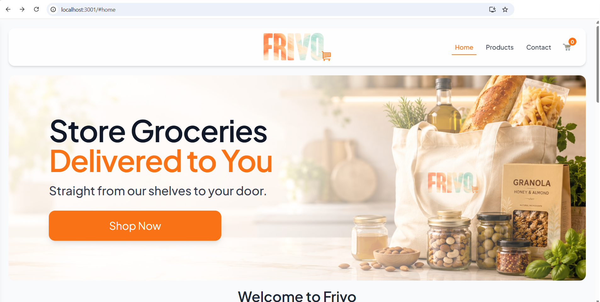
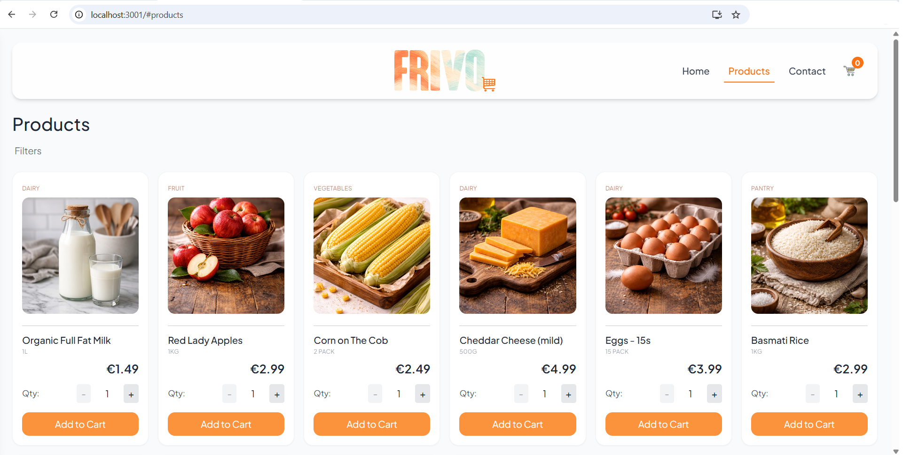
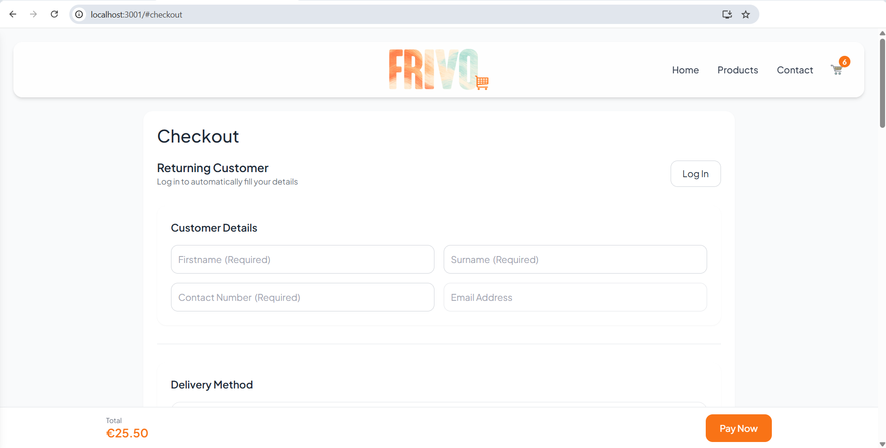
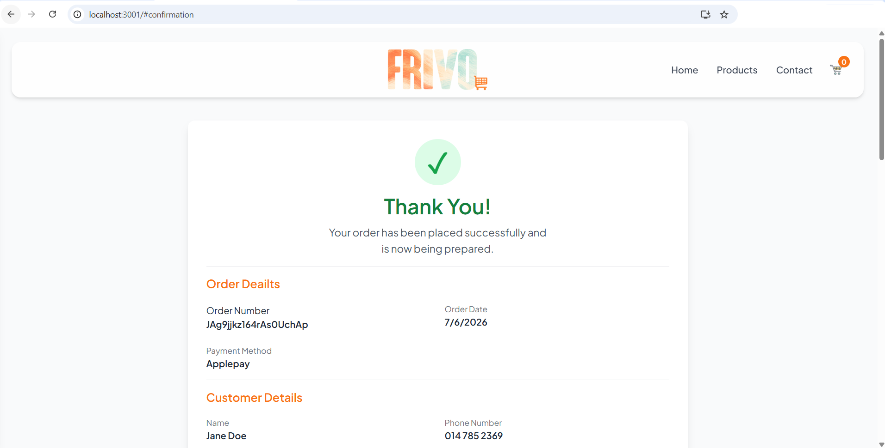
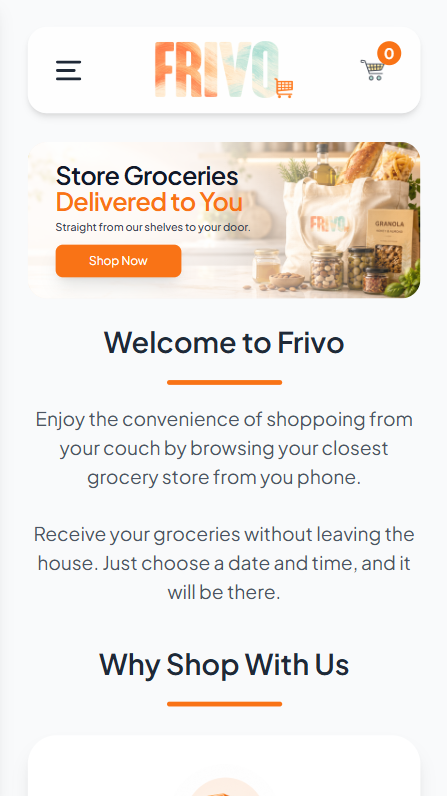

# FRIVO - Grocery Web Application

FRIVO is a web-based grocery ordering platform designed to improve accessibility for users in rural and suburban areas. It allows users to browse products and place orders. The stores would be able to add and manage products and their stock counts efficiently through a connected backend system.

# Features:
- View available grocery products
- Product category filtering
- Add items to cart/shopping cart
- Place orders with quantity validation
- Automatic stock updates after successful purchases
- Backend validation and error handling
- Delivery and collection checkout
- Customer validation
- Notification system
- Order confirmation page
- Firebase product storage
- Contact page
- Responsive disign

# Technologies
1. Backend:
- Node.js
- Express.js
2. Frontend:
- React
- JavaScript
- HTML
- CSS
3 Database
- Firebase Firestore

# Project Structure:
```
- /backend → API (routes, controllers, Firebase integration)
     → controllers/
     → routes/ 
     → config/
     → server.js
- /frontend → User interface
     → build/
     → public/
     → src/
        → assets/
        → pages/
            → assets/
        → components/ 
        → App.js
```

# Installation

## Prerequisites

Before running the appliation, esure the following software is installed:
- Node.js (v18 or later recommended)
- npm
- Git
- A Firebase project with Firestore enabled. 

 ### 1. Clone repository

 ```bash
git clone https://github.com/YOUR-USERNAME/FRIVO.git
```

Navigate into the project folder

```bash
cd grocery-app
```

### 2. Install backend dependencies:
Navigate to backend and install dependencies. In the terminal, enter the following:

```bash
cd backend
```
```bash
npm install
```

### 3. Install frontend dependencies:
Navigate to the frontend and install dependencies. In the terminal, enter the following:

```bash
cd frontend
```
```bash
npm install
```

# Firebase Configuration
## This project requires a Firebase service account key.

1. Create a Firebase project
2. Generate a service account key
3. Place the file in:
backend/config/serviceAccountKey.json

⚠️ This file is NOT included in the repository for security reasons.


# How to Run the Application

### 1. Start the server (backend). In the backend terminal, run the following prompt:
node server.js

### 2. Run the app in development mode (frontend). In the frontend terminal, run the following prompt:
npm start

### 3. Server runs on:
http://localhost:3000

Open [http://localhost:3000](http://localhost:3000) to view it in your browser if it hasnt opened automatically.

The page will reload when you make changes

# API Endpoints

Method	→  Endpoint	   →   Description
- GET	  →  /products	 →   Get all products
- GET	  →  /orders	   →   Get all orders
- POST  →  /cart	     →   Add item to cart
- POST	→  /order	     →   Place an order
- PATCH	→  /products/	 →   Update stock
- POST  →  /products   →   Create new product

# Screenshots

### Home Page



---

### Product Catalogue



---

### Checkout



---

### Confirmation Page



---

### Responsive Mobile Layout




# Future Improvements
- User authentication system and user accounts.
- Order history
- Product management system and admin dashboard for adding or removing products.
- Improved UI/UX design.
- Product enlargement page with a description and similar items scrollbar.
- System to select alternatives incase a selected prodcut is out of stock.
- Wider category selection
- Product and category based home page.
- Order tracking system

# License
This project is licensed under the MIT License.

# About This Project
This project was developed as part of a Java & Web Development portfolio for IU International Univeristy. It is also designed with real-world scalability in mind and has potential for commercial use.
